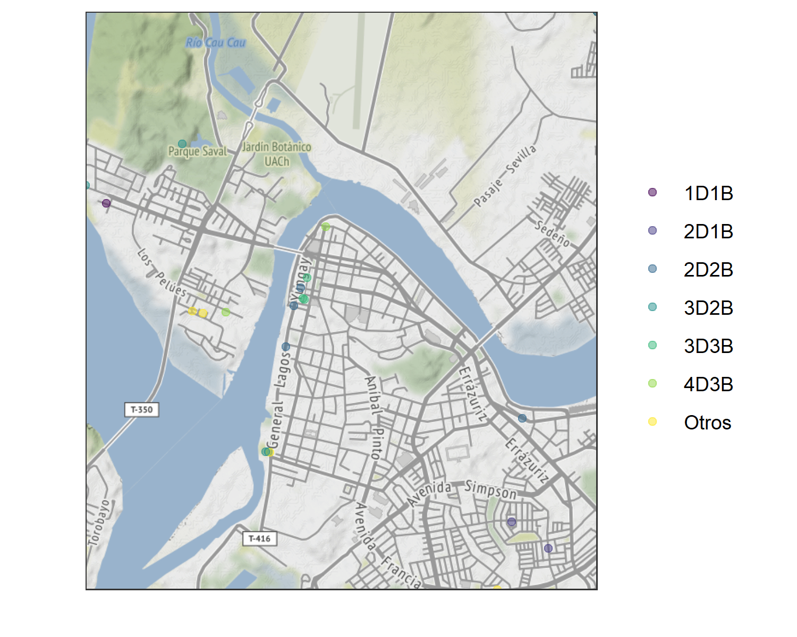
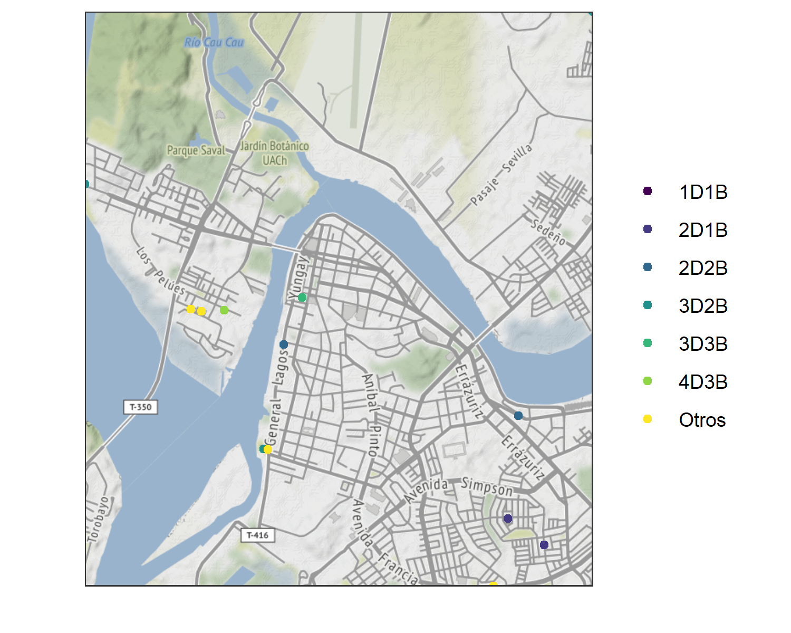
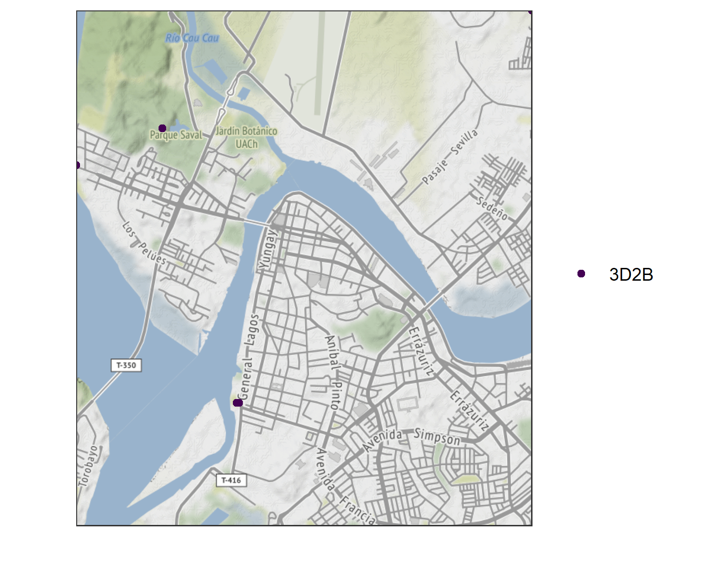
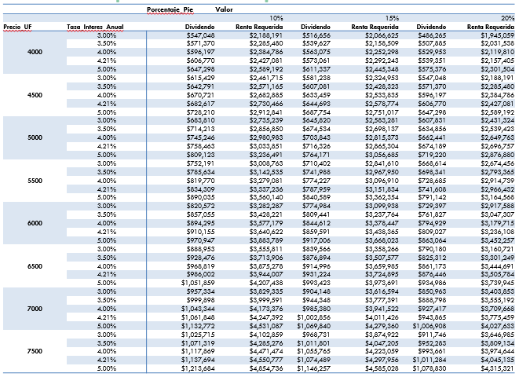

```{r opciones de cada chunk de código, echo=FALSE}
knitr::opts_chunk$set(echo = FALSE, message=FALSE, warning=FALSE, dpi=300,
                      ft.left=2.5)
```

```{r Librerías/Paquetes, include = FALSE}
source("Scripts/00-CargaLibrerias.R", encoding = "UTF-8")
```

```{r load Data}
# esto facilita la imrpesion masiva
barrio <- params$barrio %>% as.character()
viv <- params$viv %>% as.character()
ven <- params$ven %>% as.character()
source("Scripts/04-load_data.R", encoding = "UTF-8")
```

```{r feat Data}
source("Scripts/05-feat_data.R", encoding = "UTF-8")
```

```{r Analisis}
source("Scripts/06-analisis.R", encoding = "UTF-8")
```

```{r mapa}
source("Scripts/07-mapa.R", encoding = "UTF-8")
```

```{r opciones digitos}
options(digits = 1, OutDec = ".")
```

## Descripción

- Fecha descarga datos: **`r df$fecha_consulta[1] %>% format('%d-%m-%Y')`**
- Datos de venta de **`r viv`** en barrio:
  + `r barrio`
- Total de datos válidos levantados: **`r nrow(df)`**
- Fuente: *https://www.portalinmobiliario.com/*

## Notas

- Esta presentación fue generada automaticamente
- Interesa mostrar la totalidad de los datos recolectados, para resaltar ofertas puntuales que pueden ser convenientes
- Dado lo anterior se opto en su mayoria por visualizar los datos en gráficos de Scatter

# TABLAS RESUMEN

## Precios según Dormitorios y Baños [MM y UF]
```{r tabla precio, ft.top=1.25}
tabla_precio %>% 
  flextable() %>% 
  colformat_double(big.mark=" ", digits=0, j=colnames(tabla_precio)[2:5]) %>% 
  fontsize(size = 14, part = "all") %>% 
  bold(j=1, bold=T) %>% bold(bold=T, part="header") %>% 
  autofit(add_w = 0.3, add_h = 0.1)
```

```{r tabla precioUF, ft.top=4.25}
tabla_precioUF %>%  
  flextable() %>% 
  colformat_double(big.mark=" ", digits=0, j=colnames(tabla_precio)[2:5]) %>% 
  fontsize(size = 14, part = "all") %>% 
  bold(j=1, bold=T) %>% bold(bold=T, part="header") %>% 
  autofit(add_w = 0.3, add_h = 0.1)
```

## Superficie Total [m^2^] según Dormitorios y Baños
```{r tabla superficie}
tabla_sup %>% 
  flextable() %>% 
  colformat_double(big.mark=" ", digits=0, j=colnames(tabla_sup)[2:5]) %>%
  fontsize(size = 14, part = "all") %>% 
  bold(j=1, bold=T) %>% bold(bold=T, part="header") %>% 
  autofit(add_w = 0.3, add_h = 0.15)
```

## Precio por área total según Dormitorios y Baños [UF/m^2^]
```{r tabla precio area}
tabla_preciosup %>% 
  flextable() %>% 
  colformat_double(big.mark=" ", digits=0, j=colnames(tabla_preciosup)[2:5]) %>%
  fontsize(size = 14, part = "all") %>% 
  bold(j=1, bold=T) %>% bold(bold=T, part="header") %>% 
  autofit(add_w = 0.3, add_h = 0.15)
```

# DISTRIBUCIÓN DATOS

## Ubicación Viviendas
```{r mapa all}

```

## Boxplot Precio [UF]
```{r boxplot }
boxplot
```

## Precio de Viviendas [UF]
```{r jitter}
jitter
```

## Distribución Precio [UF]
```{r densidad}
densidad
```

## ECDF Precio [UF]
```{r CDF}
ecdf
```

# RELACIÓN ENTRE VARIABLES

## Precio [UF] vs Superficie Total [m^2^]
```{r scatter}
plot(scatter)
```

## Precio [UF] vs Superficie Total [m^2^] (`r tipo_interes`)
```{r scatter 2D2B}
scatter_interes
```

## Precio [UF] según número de dormitorios y baños
```{r}
scatter_dorm_bano
```

# ANALISIS PRECIO POR AREA [UF/m^2^]

## Boxplot UF/m^2^

```{r Boxplot precio, fig.asp=0.5}
boxplot_precio
```

## UF/m^2^ vs Superficie Total [m^2^]
```{r scatter precio por area, fig.cap="Tamaño representa un menor costo de UF por área"}
scatter_precio
```

## UF/m^2^ vs Superficie Total [m^2^] (`r tipo_interes`)
```{r, fig.cap="Tamaño representa un menor costo de UF por área"}
scatter_precio_interes
```

## Ubicación 15 mejores Viviendas según precio por área
```{r}

```

## Ubicación 15 mejores Viviendas `r tipo_interes` según precio por área
```{r}

```

## Dividendo aproximado a un plazo de 20 años
```{r, fig.width=15, fig.height=12}

```

